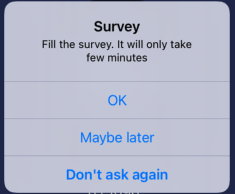

# Survey

  

 

Swift package module used for asking User to fill the Survey. 

It will display an alert with three options: "OK", "Maybe later", "Don't ask again". Based on User input and time passed from the last input, it will check whether to display the alert again.

<p align="center">
    
</p>

After pressing positive button, Survey module will open link to the survey with `SFSafariViewController`, which will allow User to easly go back to your app after completing the Survey.

## Content

- [Installation](#installation)
- [Usage](#usage)
- [Show alert rules](#show-alert-rules)
- [Additional settings](#additional-settings)
- [Testing](#testing)
- [Author](#author)

## Installation

### Swift Package Manager

1. In Xcode go to File -> Add Package...
2. In Search or Enter Package URL paste `https://github.com/LooseMarek/Survey`
3. Dependency Rule -> Version Up to Next Major -> 1.0.0 < 2.0.0
4. Add Package
5. On the pop up screen -> Add Package

## Usage

### Import module on top of your class

```
import Survey
```

### Initalize Survey

```
let survey: SurveyProtocol = Survey()
```

### Setting presenter

It's mandatory to set presenter before showing Survey alert, as otherwise this will throw an error.

Set it by calling:

```
survey.setPresenter(_ presenter: UIViewController) -> Self
```

### Setting link to the survey

By default Survey module will display `https://www.google.com/`.

Set link to your survey by calling:

```
survey.setLink(_ link: String) -> Self
```

### Showing alert

To show Survey alert call:

```
survey.showAlert()
```

This doesn't guarantee the alert will actually show, as the Survey module relay on a display frequency and the last user input.

For more information see [Show alert rules](#show-alert-rules).


### Example use

```
import Survey

let survey: SurveyProtocol = Survey()
survey
    .setPresenter(self)
    .setLink("https://www.yoursurvey.com/")

try! survey.showAlert()
```

## Show alert rules

When User never seen the survey alert before, calling `survey.showAlert()` will display the alert.

On any subsequent calls to `survey.showAlert()`, Survey module will decide whether to display an alert or not, based on User last input and the time pasted from it.

Default display frequency is:

- 90 days from last time User filled the survey
- 14 days from last time User pressed "Ask Later" button

What that means, if enought time haven't past yet from User's last input, alert won't display even if we call `survey.showAlert()` again.

### Example use case

1. User pressed "Ask Later" button at the first time when alert had been displayed
2. User used an app again 3 days later and we called `survey.showAlert()` again - alert didn't display
3. User used an app again 14 days later (from the first time when alert had been displayed) - alert had been shown to the User again

### Recommendation

For the best User experience, it's recommended to not call `survey.showAlert()` on the start of the app.

Suggest to find the right time such: after completing the task, achieving the goal etc.

It's also best to ask User to fill the survey if it's a returning User - that will increase chances of User pressing positive button as after using the app for some time, User may have much better feedback for you.

## Additional settings

### Custom display frequency

By default, alert will be displayed again after:

- 90 days from last time User filled the survey
- 14 days from last time User pressed "Ask Later" button

To change alert display frequency call:

```
survey.setDisplayFrequency(_ displayFrequencyInDays: DisplayFrequencyInDays) -> Self
```

#### Example use

```
let displayFrequencyInDays = DisplayFrequencyInDays(fromFilled: 365, fromAskLater: 30)

survey.setDisplayFrequency(displayFrequencyInDays)
```

### Custom UserDefaults

If you prefer, you can also use your own UserDefaults for storing button press logs by calling:

```
survey.setUserDefaults(_ userDefaults: UserDefaults) -> Self
```

By default, Survey module will use `UserDefaults.standard`.

### Custom alert labels

To change alert labels call:

```
survey.setAlertLabels(_ alertLabels: AlertLabels) -> Self
```

#### Example use

```
var alertLabels = AlertLabels()
alertLabels.title = "Title"
alertLabels.message = "Your customised message"
alertLabels.positiveButton = "OK"
alertLabels.neutralButton = "Maybe Later"
alertLabels.negativeButton = "No"

survey.setAlertLabels(alertLabels)
```

### Force show alert

If you would like to ignore checking time pasted from the last User's input, you can force showing an alert by calling:

```
try! survey.forceShowAlert()
```

Note: This might be a bad user experience, if User pressed "Don't ask again" and you would ignore it, so use with caution.

Note: As with `survey.showAlert()`, it's mandatory to set presenter before force showing Survey alert, as otherwise this will throw an error.

### Reset button press logs

You can reset cached information (logs) about last button pressed by calling:

```
survey.resetButtonPressLogs()
```

This might be usefull, if you would like to reset the Survey module logic and start over, for example when you released a new major version of your app.

Note: As with `survey.forceShowAlert()`, this might be a bad user experience, if you would reset it without any good reason, and ignore any previous user input.

### SurveyDelegate

Survey module provide three optional delegates, one for each button press. It may be use, if for example you would like to log button pressed for analytics or do any addiotional actions after button press.

To use it call:

```
survey.delegate = self
```

And implement:

```
extension YourViewController: SurveyDelegate {
    func positiveButtonPressed() {}
    func neutralButtonPressed() {}
    func negativeButtonPressed() {}
}
```

## Testing

Module is run with GitHub Actions everytime the new commit is pushed to the remote branch `master`. The testing includes:

- building the project
- running unit tests

You can also do that locally by running below commands in terminal:

Build:

```
xcodebuild -scheme 'Survey' -sdk iphonesimulator -destination 'platform=iOS Simulator,name=iPhone 11,OS=15.0' build
```

Test:

```
xcodebuild -scheme 'Survey' -sdk iphonesimulator -destination 'platform=iOS Simulator,name=iPhone 11,OS=15.0' test
```

Note: The commands above are running with iPhone 11 but you can use any iOS devices you like.

### Mocks

Survey module provides set of simple mocks to help you test your app. 

The mock classes are located in `Mocks` directory and include:

- `MockAlertController: UIAlertController`
- `MockSurvey: SurveyProtocol`
- `MockSurveyDelegate: SurveyDelegate`
- `MockSurveyHelper: SurveyHelperProtocol`
- `MockViewController: UIViewController`

## Author

Marek Loose

